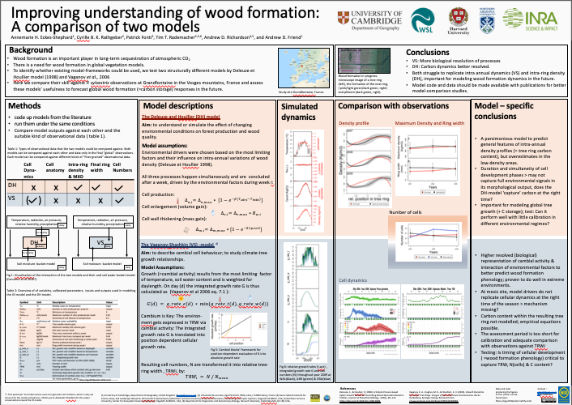

This Website prvides the data for the graphs that were presented in the Poster at the (EGU General Assembly 2019)[https://www.egu2019.eu/],
session BG2.12 - Constraining present and future global vegetation dynamics and carbon stocks.

The Abstract can be found (here)[https://meetingorganizer.copernicus.org/EGU2019/EGU2019-17876.pdf]

please go to 

The poster can be viewed again here:
 

